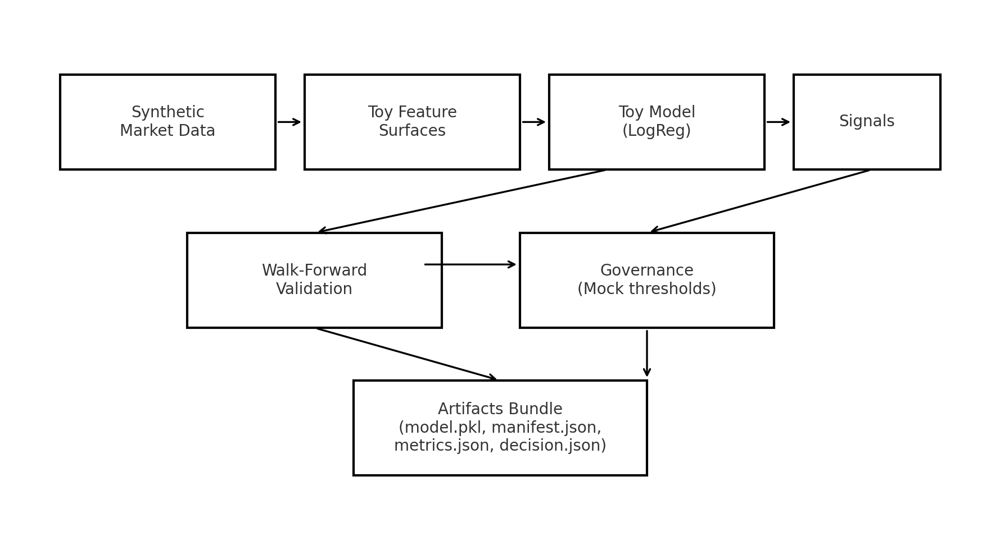

# Apex Cortex — Demo Mode (Public, Alpha-Free)

**Purpose:** A runnable demonstration of a quant signal platform’s architecture and governance thinking —
using **synthetic data** and **toy models**. This repo is intentionally **alpha-free** and safe to share publicly.



---

## What this shows
- Deterministic synthetic market data feed
- Feature surface construction (toy)
- Toy classifier (LogisticRegression)
- Walk-forward validation harness
- Governance decision (mock thresholds)
- Artifact bundling (model + manifest + metrics + decision)

## What’s intentionally omitted
- Proprietary feature engineering and regime logic
- Live thresholds, debouncing, and sizing
- Execution/routing, vendor connectors, real datasets
- Any production alpha

---

## Quickstart

```bash
git clone https://github.com/<your-username>/apex-cortex-demo.git
cd apex-cortex-demo
pip install -e .
python -m apex_cortex.demo.run
```

**Output:** A small metrics table (PF / WR / MaxDD) and an `artifacts/` folder with:
- `model_<ts>.pkl`
- `manifest_<ts>.json`
- `metrics_<ts>.json`
- `decision_<ts>.json`

### Run tests
```bash
pytest -q
```

---

## Repo Layout

```text
src/apex_cortex/
  demo/          # synthetic data, toy features/model, pipeline, governance, artifact writer, entrypoint
  interfaces/    # abstract Protocols (no implementations)
  validation/    # walk-forward + small metrics suite
tests/           # minimal tests for demo pipeline and metrics
docs/            # architecture diagram
```

---

## Why a demo repo?
This mirrors a production quant platform’s lifecycle — without publishing IP:
1. Data → Features → Model → Signals
2. Walk-forward validation / metrics
3. Governance decision surface (promote/reject)
4. Artifact bundling for reproducibility

The **real engines** (features, regimes, thresholds, execution adapters, allocators) live in **private repos**.

---

## CI / Quality
- GitHub Actions runs tests on push/PR (see `.github/workflows/ci.yml`).
- No network access; no secrets required.
- Deterministic synthetic data for reproducibility.

**Badge (add after publishing):**  
``

---

## License
Source-available for evaluation only (non‑commercial). See [LICENSE](LICENSE).  
For a standardized source-available license, consider BUSL‑1.1 and replace this file with the official text.

---

## Contact
• Name: Your Name  
• Email: your.email@example.com  
• LinkedIn: https://www.linkedin.com/in/<your-handle>/  
• GitHub: https://github.com/<your-username>/
